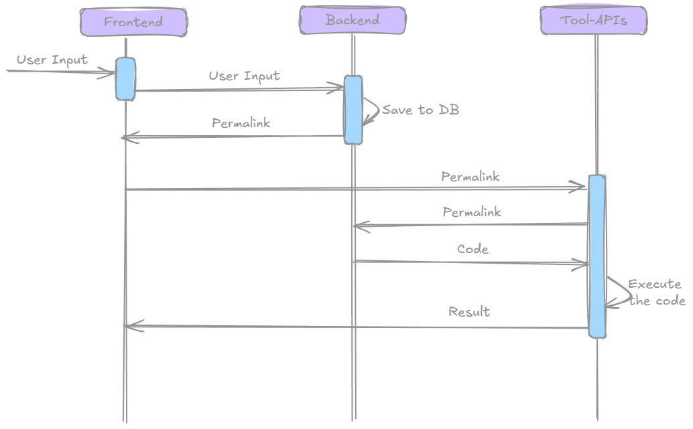

# Project Structure Overview

This guide explains the organization and architecture of the FM Playground codebase to help you understand how components work together.

## Complete Project Structure

Your forked FM Playground project contains:

```
fm-playground/
├── frontend/                   # React TypeScript application
│   ├── src/
│   │   ├── api/                # API client functions
│   │   ├── components/         # Reusable UI components
│   │   ├── contexts/           # React contexts for global state
│   │   ├── types/              # TypeScript type definitions
│   │   ├── atoms.tsx           # Jotai state management
│   │   ├── ToolMaps.tsx        # Tool registration and config
│   │   └── App.tsx             # Main application component
│   ├── tools/                  # Tool-specific implementations
│   │   ├── alloy/              # Alloy tool implementation
│   │   ├── limboole/           # Limboole tool implementation
│   │   ├── smt/                # SMT/Z3 tool implementation
│   │   ├── nuxmv/              # nuXmv tool implementation
│   │   ├── spectra/            # Spectra tool implementation
│   │   └── common/             # Shared utilities
│   ├── public/                 # Static assets
│   ├── .env.example            # Environment variables example
│   ├── vite.config.ts          # Vite build configuration
│   ├── package.json            # Frontend dependencies
│   └── tsconfig.json           # TypeScript configuration
│   └── Dockerfile              # Container configuration
├── backend/                    # Python Flask server
│   ├── db/                     # Database models and queries
│   │   ├── models.py           # SQLAlchemy models
│   │   └── db_query.py         # Database query functions
│   ├── routes/                 # API routes
│   │   ├── authentication.py   # OAuth and session management
│   │   └── playground.py       # Core API endpoints
│   ├── utils/                  # Utility functions
│   ├── migrations/             # Database migrations
│   ├── app.py                  # Main application entry point
│   ├── config.py               # Application configuration
│   ├── .env.example            # Environment variables example
│   └── pyproject.toml          # Python dependencies (poetry)
├── alloy-api/                  # Alloy backend service (Java)
│   ├── src/                    # Java source code
│   ├── lib/                    # Alloy JAR files
│   ├── build.gradle            # Gradle build configuration
│   └── Dockerfile              # Container configuration
├── limboole-api/               # Limboole backend service (Python)
│   ├── limboole.py             # Limboole execution logic
│   ├── main.py                 # FastAPI application
│   ├── tests/                  # Unit tests
│   ├── lib/                    # Limboole binaries
│   ├── pyproject.toml          # Poetry configuration
│   └── Dockerfile              # Container configuration
├── nuxmv-api/                  # nuXmv backend service (Python)
│   ├── nuxmv.py                # nuXmv execution logic
│   ├── main.py                 # FastAPI application
│   ├── tests/                  # Unit tests
│   ├── lib/                    # nuXmv binaries
│   ├── pyproject.toml          # Poetry configuration
│   └── Dockerfile              # Container configuration
├── z3-api/                     # SMT/Z3 backend service (Python)
│   ├── z3.py                   # Z3 execution logic
│   ├── main.py                 # FastAPI application
│   ├── tests/                  # Unit tests
│   ├── pyproject.toml          # Poetry configuration
│   └── Dockerfile              # Container configuration
├── spectra-api/                # Spectra backend service (Python)
│   ├── spectra.py              # Spectra execution logic
│   ├── main.py                 # FastAPI application
│   ├── tests/                  # Unit tests
│   ├── lib/                    # Spectra binaries
│   ├── pyproject.toml          # Poetry configuration
│   └── Dockerfile              # Container configuration
├── .github/                    # GitHub Actions workflows
│   └── workflows/
│       └── ci.yml              # Continuous integration
├── docs/                       # Documentation (this site!)
├── compose.yml                 # Docker Compose configuration
├── .env.example                # Global environment variables
├── .gitignore                  # Git ignore patterns
├── .pre-commit-config.yaml     # Pre-commit hooks configuration
├── python-setup.toml           # Python project metadata
├── update_versions.py          # Version management script
├── CHANGELOG.md                # Release notes
├── LICENSE                     # MIT License
└── README.md                   # Project documentation
```

## Architecture Overview


### Data Flow Diagram




### Frontend Architecture

The frontend is a **React TypeScript** application built with **Vite**:

```
Frontend (React + TypeScript)
├── Monaco Editor (Code editing)
├── Material-UI (UI components)
├── Jotai (State management)
├── React Router (Navigation)
└── Tool-specific components
```

#### Key Files
- `src/api/playgroundApi.ts` - API client functions for interacting with the backend. This file contains functions for fetching, saving, authenticating, and managing user sessions.
- `src/components/Editor.tsx` - [Monaco code editor wrapper for React](https://www.npmjs.com/package/@monaco-editor/react). 
- `src/components/LspEditor.tsx` - This is [another wrapper](https://www.npmjs.com/package/monaco-editor-wrapper) around the Monaco Editor by [TypeFox](https://github.com/TypeFox) that integrates with Language Server Protocol (LSP) for enhanced code editing features.

- `src/ToolMaps.tsx` - Central tool configuration and registration. This file maps each tool to its configuration, including API endpoints, file extensions, and language support.
```typescript
// ToolMaps.tsx
export const fmpConfig: FmpConfig = {
  title: 'FM Playground',
  repository: 'https://github.com/fm4se/fm-playground',
  issues: 'https://github.com/fm4se/fm-playground/issues',
  tools: {
    als: { name: 'Alloy', extension: 'als', shortName: 'ALS' },
    xmv: { name: 'nuXmv', extension: '.xmv', shortName: 'XMV' },
    ... // Other tools
  },
};
```

- `src/atoms.tsx` - Global state management with Jotai. This file defines global state atoms for managing the current tool, code content, and execution results e.g.:
    - `languageAtom` - Currently selected tool
    - `currentEditorValueAtom` - Current code content
    - `outputAtom` - Execution results
    - You can add more atoms as needed for additional state management.
- `tools/common/lspWrapperConfig.ts` - Configuration for the LSP wrapper, including language server settings and capabilities. For example, this file contains the configuration for the SMT language server, including its capabilities and supported languages.

```typescript
//lspWrapperConfig.ts
// Load the worker ports for SMT
const smtExtensionFilesOrContents = new Map<string, string | URL>();
smtExtensionFilesOrContents.set(`/smt-configuration.json`, smtLanguageConfig);
smtExtensionFilesOrContents.set(`/smt-grammar.json`, responseSmtTm);

// Create message channels for each worker
const smtChannel = new MessageChannel();
smtWorkerPort.postMessage({ port: smtChannel.port2 }, [smtChannel.port2]);

// Create message readers and writers for each channel
const smtReader = new BrowserMessageReader(smtChannel.port1);
const smtWriter = new BrowserMessageWriter(smtChannel.port1);

return {
  ...,
  languageClientConfigs: {
    smt: {
        languageId: 'smt',
        connection: {
            options: {
                $type: 'WorkerDirect',
                worker: smtWorkerPort,
                messagePort: smtChannel.port1,
            },
            messageTransports: { reader: smtReader, writer: smtWriter },
        },
    },
  }
}
```


- `vite.config.ts` - Vite build configuration for the frontend application, including plugins and optimization settings. There is a proxy configuration for API calls to the backend services, allowing you to access the tool APIs without CORS. This comes in handy when deploying the application in a containerized environment, where the frontend and backend services are running on different ports or domains.

```typescript
// vite.config.ts
proxy: {
  '/nuxmv': {
      target: 'http://fmp-nuxmv-api:8080',
      changeOrigin: true,
      secure: false,
      rewrite: (path) => path.replace(/^\/nuxmv/, ''),
  },
  '/smt': {
      target: 'http://fmp-z3-api:8080',
      changeOrigin: true,
      secure: false,
      rewrite: (path) => path.replace(/^\/smt/, ''),
  },
  '/alloy': {
      target: 'http://fmp-alloy-api:8080',
      changeOrigin: true,
      secure: false,
      rewrite: (path) => path.replace(/^\/alloy/, ''),
  },
  '/spectra': {
      target: 'http://fmp-spectra-api:8080',
      changeOrigin: true,
      secure: false,
      rewrite: (path) => path.replace(/^\/spectra/, ''),
  },
},
```

### Backend Architecture

The backend follows a microservices architecture:

```
Backend Services
├── Main Backend (Flask)          # Session, auth, data management
├── Z3 API (FastAPI)              # SMT solver
├── Limboole API (FastAPI)        # SAT solver
├── nuXmv API (FastAPI)           # Model checker
├── Spectra API (FastAPI)         # Reactive synthesis
└── Alloy API (Spring Boot)       # Relational modeling
```

#### Key Files
- `app.py` - Main Flask application entry point. 
- `config.py` - Application configuration, including logging, rate limiting, database and OAuth settings
- `routes/authentication.py` - OAuth login, session management
- `routes/playground.py` - Core API endpoints for saving/loading code, user history etc.
Look at the API documentation (#TODO) for more details on the available endpoints and their usage.


### Tool-Specific Backend Architecture

Each tool runs as a separate microservice, allowing independent scaling and development. The backend services are implemented using FastAPI for Python-based tools and Spring Boot for the Alloy API.

#### alloy-api (Java)
##### Key Files
- `src/main/java/.../AlloyInstanceController.java` - All the API endpoints for Alloy, including model parsing, execution, and result retrieval. Additionally, a timeout mechanism is implemented to handle long-running Alloy executions.

#### Python-based APIs (Limboole, nuXmv, SMT, Spectra)

The limboole-api, nuXmv-api, z3-api and spectra-api are implemented using FastAPI. They provide endpoints for executing the Limboole tool, managing input files, and retrieving results. These services execute the respective tool binaries in a subprocess and return the results via HTTP.

##### Key Files
- `main.py` - FastAPI application entry point, defining API routes and handling requests. Additionally, it includes a redis cache for storing results. For example the nuXmv API-
```python
def run_nuxmv(code: str) -> str:
  if is_redis_available():
    @cache.cache()
    def cached_run_nuxmv(code: str) -> str:
      return process_commands(code)
    try:
      return cached_run_nuxmv(code)
    except Exception:
      raise HTTPException(status_code=500, detail="Error running nuXmv cli")
  else:
    try:
      return process_commands(code)
    except Exception:
      raise HTTPException(status_code=500, detail="Error running nuXmv cli")
```

- `{tool}.py` - Tool-specific logic for executing the tool and processing results. For example, the `nuxmv.py` file contains the logic for executing the nuXmv tool, parsing the output, and returning the results in a structured format.
```python
# nuxmv.py
def run_nuxmv(code: str) -> str:
  tmp_file = tempfile.NamedTemporaryFile(mode='w', delete=False)
  tmp_file.write(code.strip())  
  tmp_file.close()

  command = [NU_XMV_PATH, "-dynamic", tmp_file.name] 
  try:
    result = subprocess.run(command, capture_output=True, text=True, timeout=60)
    os.remove(tmp_file.name)
    if result.returncode != 0:
      return prettify_error(result.stderr)
    return prettify_output(result.stdout)+ prettify_error(result.stderr)
  except subprocess.TimeoutExpired:
    os.remove(tmp_file.name)
    return f"<i style='color: red;'>Timeout: Process timed out after 60 seconds.</i>"
```

- `lib/` - Tool binaries and dependencies. This directory contains the tool binaries, such as the Limboole binary, nuXmv binary, and Z3 solver, which are required for executing the respective tools. These binaries are not included in the repository (except Spectra) but can be downloaded from the respective tool websites and placed in this directory.


## 🔗 Next Steps

Now that you understand the project structure and architecture, you can:

1. **[Add New Tools →](../../development/adding-tools.md)** - Extend the playground with custom tools
2. **[Deploy →](../../development/deployment.md)** - Test changes and build for production

